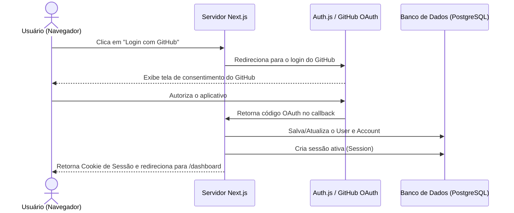
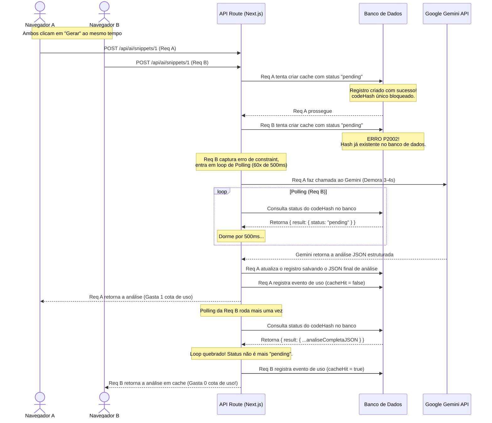

# 🧠 Arquitetura e Fluxos (Autenticação & IA)

Este documento destrincha o funcionamento interno do **SnippetVault**, detalhando a lógica de login e o avançado ciclo de vida das requisições de Inteligência Artificial (incluindo o mecanismo de cache, controle de limites diários e prevenção de concorrência por banco).

---

## 1. Fluxo de Autenticação e Segurança

O SnippetVault utiliza o **Auth.js** (NextAuth v5) integrado com o **GitHub OAuth** para autenticação.



* **Restrição de Acesso:** Rotas privadas de API e a página `/dashboard` verificam a sessão do usuário usando a função [getAuthenticatedUserId](../src/lib/api/auth.ts). Requisições sem sessão válida recebem resposta `401 Unauthorized`.

---

## 2. Ciclo de Vida da Análise de IA (Gemini 2.5)

Quando um usuário abre o assistente de IA ou visualiza um snippet público, a aplicação otimiza as chamadas ao Gemini usando normalização e hashing de código.

### Passo 2.1: Normalização e Hashing de Código
Para evitar que diferenças de quebra de linha (Windows `\r\n` vs Linux `\n`) ou espaços no final do arquivo alterem a assinatura do código, o SnippetVault executa:
1. **Normalização:** A função [normalizeCodeForHash](../src/services/ai/snippet-ai-service.ts) substitui todos os caracteres `\r\n` por `\n` e executa um `.trim()` no código para limpar espaços vazios no início e final do script.
2. **Hash SHA-256:** A função [getSnippetCodeHash](../src/services/ai/snippet-ai-service.ts) gera um hash SHA-256 único e curto (64 caracteres) que identifica univocamente aquela estrutura de código.

---

## 3. O Mecanismo de Lock contra Concorrência (Vercel Ready)

Em plataformas como a **Vercel**, os servidores rodam de forma serveless (sem estado). Isso significa que criar um `Map` ou `Set` na memória do NodeJS não previne concorrência, pois requisições simultâneas podem cair em servidores físicos diferentes.

O SnippetVault resolve isso utilizando o **Banco de Dados como Lock Central**.

### O Fluxo de Lock e Polling Concorrente:



### Detalhes de Tratamento de Erros no Lock:
* **Remoção em caso de Falha:** Se a chamada para a API do Gemini falhar na requisição principal (Req A), o bloco `catch` executa um delete do registro com `codeHash` correspondente. Isso impede que o sistema fique travado permanentemente em estado `pending` caso ocorra uma falha técnica com a IA.
* **Timeout do Polling:** O loop de consulta dura até 60 tentativas (máximo de 30 segundos). Se atingir o limite e ainda estiver pendente, o sistema remove o registro e dispara um erro de timeout instrutivo para o usuário tentar novamente.

---

## 4. Timeout da Vercel (`maxDuration = 60`)

As rotas da Vercel no plano gratuito têm um tempo máximo de resposta padrão de 10 a 15 segundos. Como a API do Gemini pode demorar dependendo do tamanho do código analisado, e a fila de concorrência pode somar tempo de espera, exportamos a configuração:
```typescript
export const maxDuration = 60;
```
no arquivo [app/api/ai/snippets/[id]/route.ts](../app/api/ai/snippets/[id]/route.ts). Isso instrui a Vercel a estender a duração limite da função serveless para 60 segundos, prevenindo erros de Gateway Timeout 504.

---

## 5. Cota Diária de Uso da IA (`AI_DAILY_LIMIT`)

* **Definição:** O limite diário é controlado no arquivo `.env` pela variável `AI_DAILY_LIMIT` (padrão: 50 chamadas).
* **Cálculo da Cota:** Ao chamar o método [getUsageSummary](../src/services/ai/snippet-ai-service.ts), o sistema busca na tabela `AiUsageEvent` todos os registros com `cacheHit = false` (chamadas que acionaram o Gemini de verdade) associados ao `userId` no período do dia atual (janela que reinicia às `00:00:00 UTC` e vai até `23:59:59 UTC`).
* **Cache Hits são Grátis:** As requisições que encontram o cache no banco de dados registram `cacheHit = true` e **não descontam** da cota diária do usuário.
* **Bloqueio Limite:** Se o usuário atingir seu limite diário e tentar analisar um snippet novo, o sistema retorna um erro `429 Too Many Requests` com a mensagem explicativa. No entanto, se o snippet solicitado já possuir análise em cache, ela será exibida instantaneamente sem restrições.

---

## 6. Atualização Manual de Análise (*Force Refresh*)

* **Propósito:** Se o desenvolvedor suspeitar que a IA gerou uma resposta desatualizada ou quer apenas reavaliar o snippet de forma fresca, ele pode forçar um recálculo.
* **Funcionamento:** Ao enviar o parâmetro `forceRefresh: true` no corpo da requisição POST:
  1. A API deleta o registro correspondente ao `codeHash` na tabela `AiSnippetAnalysis`.
  2. O banco dispara a deleção em cascata dos `AiUsageEvent` vinculados a esse cache.
  3. A variável `cached` é forçada a ser `null`, direcionando a requisição para um ciclo novo de chamada ao Gemini.
