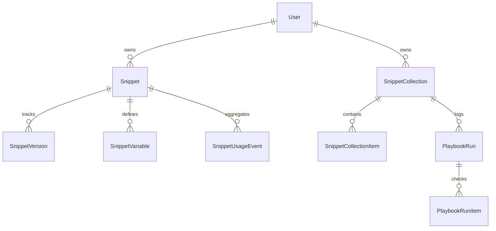

# 🚀 Recursos Avançados do SnippetVault — Eevolução do Sistema

Este guia detalha a arquitetura, o funcionamento e a implementação de todos os recursos de produtividade, IA, versionamento, segurança e playbooks adicionados ao SnippetVault. Ele foi estruturado para explicar passo a passo o funcionamento técnico de cada engrenagem do sistema.

---

## 🗺️ Sumário
1. [Histórico de Versionamento e Code Diff](#1-histórico-de-versionamento-e-code-diff)
2. [Placeholders de Templates (Variáveis)](#2-placeholders-de-templates-variáveis)
3. [Visibilidade, Share Tokens & Forks](#3-visibilidade-share-tokens--forks)
4. [Playbooks Avançados, Execução & Exportação](#4-playbooks-avançados-execução--exportação)
5. [IA Expandida, Geradores & Estatísticas](#5-ia-expandida-geradores--estatísticas)
6. [Importação Segura & Busca Semântica](#6-importação-segura--busca-semântica)
7. [Banco de Dados (Novos Modelos e Campos)](#7-banco-de-dados-novos-modelos-e-campos)
8. [Auditoria de Segurança (SSRF & Path Traversal)](#8-auditoria-de-segurança-ssrf--path-traversal)

---

## 1. Histórico de Versionamento e Code Diff

### Como funciona:
Toda vez que um snippet é criado ou editado (por exemplo, quando o usuário altera o título, código, linguagem, descrição ou tags), o SnippetVault gera automaticamente uma nova linha na tabela `SnippetVersion`.
* **Histórico Completo:** A versão 1 é gerada na criação. Cada edição posterior incrementa o número da versão (`version: 2`, `version: 3`, etc.).
* **Restauração Segura:** O usuário pode navegar pelo histórico e clicar em "Restaurar". Ao fazer isso, o sistema tira um snapshot do estado atual (gerando uma nova versão) e restaura o código e metadados da versão antiga selecionada.

### Visualizador de Diferenças (Diff Viewer):
Construímos um algoritmo nativo de LCS (Longest Common Subsequence) em TypeScript puro no componente [CodeDiffViewer](file:///home/emanuel/Área de trabalho/devs_ntx/snippetvault/src/components/dashboard/editor/CodeDiffViewer.tsx). Ele compara linha por linha dois textos e gera um diff visual de adições e remoções no estilo Git:
* Linhas adicionadas recebem fundo verde e sinal de `+`.
* Linhas removidas recebem fundo vermelho e sinal de `-`.
* Linhas idênticas são exibidas normalmente sem marcações.

---

## 2. Placeholders de Templates (Variáveis)

### Como funciona:
Se o código do seu snippet contém variáveis no formato `{{NOME_DA_VARIAVEL}}` (ex: `const token = "{{API_TOKEN}}"`), o sistema detecta automaticamente esses placeholders.
1. **Modal de Cópia Inteligente:** Em vez de copiar o código cru, ao clicar em "Copiar com Variáveis", abre-se o [CopyVariablesModal](file:///home/emanuel/Área de trabalho/devs_ntx/snippetvault/src/components/dashboard/modals/CopyVariablesModal.tsx).
2. **Preenchimento Temporário:** O usuário digita os valores para cada variável.
3. **Mecanismo de Máscara (Segurança):** Variáveis que contêm termos sensíveis como `KEY`, `TOKEN`, `PASSWORD`, `SECRET`, `PWD` ou `PASS` em seu nome têm seu campo do formulário ocultado com bolinhas (`type="password"`) para evitar exposição visual na tela (ombro-a-ombro/shoulder surfing).
4. **Cópia Substituída:** Os valores digitados são injetados temporariamente no código antes de copiá-lo para a área de transferência do usuário, mantendo o código original inalterado no banco de dados.

---

## 3. Visibilidade, Share Tokens & Forks

### Visibilidade Avançada:
* **Private:** Apenas o dono do snippet pode visualizá-lo e acessá-lo.
* **Unlisted:** O snippet não aparece em buscas públicas, mas pode ser acessado por qualquer pessoa que possua o link direto ou o token de compartilhamento.
* **Public:** O snippet é listado na busca pública e na landing page do sistema.

### Tokens de Compartilhamento Temporário (Share Tokens):
O usuário pode gerar um link com token único criptográfico (usando `crypto.randomBytes(24).toString("hex")`) e definir uma data opcional de expiração (`shareExpiresAt`).
* **Expiração Automática:** Ao tentar acessar um snippet via token compartilhado, o servidor valida se o token ainda é vigente. Se expirou, o acesso é sumariamente bloqueado.
* **Revogação Dinâmica:** O dono do snippet pode invalidar ou revogar o token a qualquer momento no dashboard, quebrando todos os links gerados anteriormente.

### Sistema de Forks (Bifurcação):
Ao visitar um snippet público ou compartilhado de outro usuário, o desenvolvedor logado verá o botão "Fork".
* Ao clicar, o SnippetVault cria uma cópia idêntica do snippet no painel do usuário logado como `private`.
* O snippet copiado registra a origem em `forkedFromId` para manter a autoria original e permitir rastreabilidade das referências de código.

---

## 4. Playbooks Avançados, Execução & Exportação

Os Playbooks evoluíram de coleções estáticas para uma mesa de trabalho interativa de desenvolvimento.

### Checklist de Execução (Playbook Runs):
* **Modo Execução:** O usuário pode "rodar" um playbook. Isso gera uma entrada em `PlaybookRun` com status `"running"`.
* **Rastreabilidade por Etapa:** Cada snippet associado torna-se um passo com status individual (`pending`, `done`, `skipped`) e permite anotações específicas do passo.
* **Persistência de Progresso:** O progresso do checklist e as anotações temporárias do desenvolvedor são salvos em tempo real no banco, permitindo fechar o navegador e continuar depois.

### Exportação Multiformato:
Disponível em `/api/collections/[id]/export?format=...`:
1. **Markdown (`format=markdown`):** Retorna um arquivo `.md` unificado contendo o título da coleção, descrição, e todos os snippets formatados com seus respectivos blocos de código markdown.
2. **JSON (`format=json`):** Retorna a estrutura relacional completa da coleção e seus snippets em formato estruturado.
3. **ZIP (`format=zip`):** Compila e compacta um arquivo ZIP usando a biblioteca `adm-zip`. O ZIP inclui um `README.md` explicativo no topo e os snippets salvos em arquivos reais nos caminhos físicos configurados pelo usuário no campo `filePath` (ex: `src/utils/auth.ts`, `docker/docker-compose.yml`), simulando a estrutura exata do repositório de destino!

---

## 5. IA Expandida, Geradores & Estatísticas

### Relatório Multidimensional:
A resposta estruturada do Gemini 2.5 Flash agora analisa e preenche em uma única chamada de alta performance:
* **Quality Score:** Nota de 0 a 100 baseada na legibilidade e boas práticas.
* **Security Report:** Varredura detalhada contendo nível de risco (`low`, `medium`, `high`), descrição de vulnerabilidades encontradas e bugs/findings.
* **Requirements:** Lista de dependências de bibliotecas e pacotes necessários para o código funcionar.
* **Explanations:** Três modos de explicação separados: Explicação Rápida, Explicação Técnica Detalhada e Explicação Linha por Linha (em tabela estruturada).

### Geradores Independentes de IA:
1. **Suite de Testes Unitários (`/api/ai/snippets/[id]/tests`):** Gera testes automatizados baseados em frameworks selecionados pelo usuário (Jest, Vitest, PyTest, JUnit, Go Test), além de retornar instruções de setup do ambiente.
2. **README e Comentários (`/api/ai/snippets/[id]/documentation`):** Cria um arquivo de documentação técnica completo de nível de produção em formato markdown e blocos de documentação estruturados (Doc Blocks) para colar no código.

---

## 6. Importação Segura & Busca Semântica

### Importador de Código via URL:
Disponível no formulário de criação de snippet, o usuário pode digitar uma URL do GitHub ou do Gist.
* O sistema traduz automaticamente links de exibição do GitHub (`github.com/owner/repo/blob/branch/file`) para links brutos (`raw.githubusercontent.com/...`).
* Faz a requisição segura do código, adivinha a linguagem pela extensão e preenche automaticamente o título, descrição, código e tags no formulário de criação.

### Busca Semântica Inteligente:
* Ao ativar o botão com ícone de **Sparkles (Busca Semântica)** na barra de busca pública, a pesquisa deixa de fazer buscas textuais exatas (SQL `LIKE`).
* O sistema envia a consulta abstrata do usuário (ex: *"código de conexão com banco de dados usando pool"*) junto com os candidatos públicos para a API do Gemini.
* A IA analisa semanticamente quais snippets atendem ao objetivo do usuário e reordena os resultados por relevância (Re-ranking), entregando resultados altamente precisos.

### Sugestão de Snippets Relacionados:
* Implementado no endpoint `/api/snippets/[id]/related` e integrado no visualizador público de snippets (`PublicSnippetClient.tsx`).
* Calcula uma pontuação de relevância para os snippets candidatos com base em:
  * Correspondência de linguagem (+3 pontos).
  * Playbooks compartilhados em comum (+2 pontos por playbook).
  * Tags compartilhadas (+1 ponto por tag comum).
  * Autoria correspondente (+1 ponto).
* Exibe uma grade premium e responsiva com até 4 sugestões de código relacionadas para estimular a navegação e a descoberta de conhecimento.

---

## 7. Banco de Dados (Novos Modelos e Campos)

Para suportar essas melhorias, o schema do Prisma foi expandido com as seguintes tabelas e relações:

### Detalhamento das Novas Tabelas:
* **`SnippetVersion`**: Snapshots históricos do código e metadados.
* **`SnippetVariable`**: Placeholders associados a cada template.
* **`PlaybookRun`**: Cabeçalho de controle do checklist do playbook (`status`, `startedAt`, `finishedAt`).
* **`PlaybookRunItem`**: Status de cada snippet/passo na execução do checklist.
* **`SnippetUsageEvent`**: Métricas de cópia, visualização direta e solicitações de IA por snippet.
* **`AiGeneratedDoc`**: Cache de documentações técnicas e READMEs gerados por IA para economizar requisições do modelo.

---

## 8. Auditoria de Segurança (SSRF & Path Traversal)

Para garantir segurança de nível empresarial, implementamos travas restritas nos novos recursos:

### 🛡️ Proteção Contra SSRF (Server-Side Request Forgery)
No endpoint `/api/snippets/import/route.ts`:
1. **Validação de Protocolo:** Somente URLs `http:` ou `https:` são permitidas.
2. **Whitelist de Domínios:** Apenas domínios confiáveis do ecossistema GitHub são permitidos (`github.com`, `raw.githubusercontent.com`, `gist.github.com`, `gist.githubusercontent.com`).
3. **Resolução de DNS e Bloqueio de IP Privado:** O servidor resolve o hostname usando `dns.lookup` de forma assíncrona **antes** de efetuar a requisição HTTP. O IP retornado é verificado contra uma lista de redes privadas e locais (Loopback `127.0.0.1`, Link-Local, Multicast, faixas privadas RFC 1918 como `10.x.x.x`, `172.16.x.x`, `192.168.x.x`). Caso resolva para um IP local, a chamada é instantaneamente negada.

### 🛡️ Proteção Contra Path Traversal e Zip Slip
No endpoint `/api/collections/[id]/export/route.ts` ao compilar arquivos para o ZIP:
1. **Limpeza de Caminhos (`sanitizePath`):** Qualquer caractere ilegal em nomes de arquivos (como `:`, `*`, `?`, `|`) é removido.
2. **Prevenção de Subida de Diretório:** A sequência de escape `..` (dot-dot) e barras inclinadas duplicadas ou iniciais são limpas do caminho de arquivo informado pelo usuário (`filePath`).
3. Isso garante que o ZIP gerado não possa conter caminhos maliciosos que sobrescrevam arquivos do sistema operacional do desenvolvedor ao ser extraído (Vulnerabilidade Zip Slip).
